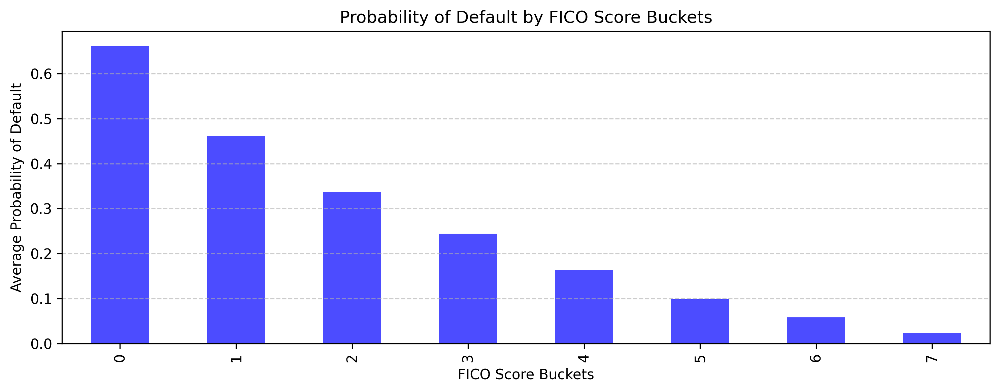

# J.P. Morgan - Quantitative Research Virtual Experience
This repository contains my work for the **Quantitative Research - J.P. Morgan** job simulation.

The project explores key concepts in quantitative finance, including commodity price forecasting, derivative pricing, and credit risk modeling through a series of simulated tasks.

> **Data Note:** For confidentiality reasons the datasets are not uploaded to this repository.

---

## 📘 Project Overview

The project is divided into four main tasks, each simulating a common challenge in a quantitative research role.

| Task | Topic | Objective | Key Techniques |
| :--- | :--- | :--- | :--- |
| **1** | Commodity Forecasting | Model and forecast natural gas prices | Time Series Analysis, Seasonal Decomposition Holt-Winters |
| **2** | Derivative Pricing | Value a gas storage contract | Cash-Flow Simulation, Forward Price Logic |
| **3** | Credit Risk Modeling | Predict probability of default (PD) | Logistic Regression, Expected Loss (EL) Calculation |
| **4** | Credit Scoring (Bucketing) | Find optimal FICO score buckets | Log-Likelihood Optimization, Dynamic Programming |

---

## 📂 Repository Structure

The project separates core logic (`/src`) from analysis and visualizations (`/notebooks`) for clarity and reusability.

.
├── notebooks/
│   ├── task_1_commodities_analysis.ipynb
│   ├── task_3_credit_risk_analysis.ipynb
│   └── task_4_FICO_score_bucketing.ipynb
│
├── plots/
│   ├── task_1_nat_gas_forecast.png
│   ├── task_3_credit_risk_data_correl.png
│   ├── task_4_fico_score_distribution.png
│   ├── task_4_pd_by_fico_likelihood_optimization.png
│   └── ... (all exported plot images)
│
├── src/
│   ├── task_1_commodities_analysis.py
│   ├── task_2_derivative_pricing.py
│   └── task_3_credit_risk_analysis.py
│
├── .gitignore
├── README.md
└── requirements.txt


---

## 💡 Key Highlights & Methods

### 1. Time Series Forecasting
* Analyzed historical natural gas prices to identify strong **annual seasonality** and a mild upward trend.
* Implemented and tuned a **Holt-Winters Exponential Smoothing** model to forecast future prices, which successfully captured the seasonal peaks.

### 2. Derivative Pricing
* Built a general cash-flow simulation model to value a gas storage contract. The model is then applied using a common industry strategy: simulating injections (buying) in low-price pre-winter months and withdrawals (selling) during high-price winter months, accounting for costs.

### 3. Credit Risk Modeling
* Developed a **Logistic Regression** model to predict the **Probability of Default (PD)** based on borrower features.
* Calculated the **Expected Loss (EL)** for the portfolio using the standard risk formula:
    $EL = PD \times LGD \times EAD$

### 4. FICO Score Bucketing (Dynamic Programming)
* Implemented a **dynamic programming** algorithm to find the optimal FICO score boundaries (buckets).
* The algorithm works by maximizing the **log-likelihood** function, ensuring that the resulting buckets are the most statistically significant for separating defaulters from non-defaulters.

---

## 📊 Example Result: Optimal FICO Bucketing

The dynamic programming approach produces buckets with a clear, monotonic relationship between FICO score and default rate, validating the model's effectiveness.



---

## 🛠️ Tech Stack

* **Language:** Python
* **Data Analysis:** Pandas, NumPy
* **Modeling:** Scikit-learn, Statsmodels
* **Visualization:** Matplotlib, Seaborn

---

## 🚀 Installation & Usage

1.  **Clone the repository:**
    ```bash
    git clone [https://github.com/mathieucbd/quant-research-jp-morgan.git](https://github.com/mathieucbd/quant-research-jp-morgan.git)
    cd quant-research-jp-morgan
    ```

2.  **Install dependencies:**
    ```bash
    pip install -r requirements.txt
    ```

3.  **Explore the analysis:**
    * Detailed analysis and visualizations are in the `.ipynb` files within the `/notebooks` directory.

    * Core functions and logic are defined in the `.py` files within the `/src` directory.

